# Warehouse Waypoint Navigation — Autonomous Warehouse Delivery Robot

**Final Project — ROS 2 Robotics Masterclass (ETGAH)**

A custom differential-drive robot autonomously maps a warehouse with SLAM Toolbox, localizes in it with AMCL, and runs a repeating delivery mission across four named waypoints using Nav2 — all in Gazebo simulation.


> **Note on the robot:** this project uses a custom-built two-wheel differential-drive robot (`two_wheel_robot`) with a 2D LiDAR and RGB camera. All Nav2/AMCL/SLAM parameters below were derived from this robot's actual URDF and Gazebo plugins.

---

## 1. Project Overview & Mission

The robot must autonomously complete the following mission, starting and ending at the Charging Station:

1. Start at the **Charging Station (Home)**
2. Navigate to the **Loading Station**
3. **Wait exactly 30 seconds**
4. Navigate to the **Storage Area**
5. Navigate to the **Shipping Station**
6. **Return to the Charging Station (Home)**

Each leg waits for the previous Nav2 goal to fully succeed before the next is sent. If any goal fails, the mission stops and reports the failed location instead of continuing blindly.

---

## 2. Repository & Package Structure

```text
warehouse-waypoint-nav-ahmed-shalash/
├── robot_description/          # Custom robot URDF/Xacro, Gazebo plugins, spawn + bridge launch
│   ├── config/gz_bridge.yaml
│   ├── launch/gazebo.launch.py
│   ├── launch/display.launch.py
│   ├── meshes/
│   ├── rviz/
│   └── urdf/
├── warehouse_world/             # ETGAH-provided warehouse simulation world
│   ├── config/
│   ├── launch/warehouse_storage_launch.launch.py
│   ├── models/
│   └── worlds/warehouse_storage.sdf
├── slam_toolbox_demo/           # SLAM Toolbox mapping (online async)
│   ├── config/slam_toolbox_online_async.yaml
│   ├── launch/slam_toolbox_online_async.launch.py
│   └── map/                     # Saved map output from the mapping run
├── robot_navigation/            # AMCL + full Nav2 stack (planner, controller, behavior, BT navigator)
│   ├── config/{amcl,planner_server,controller_server,behavior_server,bt_navigator}.yaml
│   ├── launch/amcl.launch.py            # AMCL-only, for isolated localization testing
│   ├── launch/nav2_bringup.launch.py    # Full stack: map_server + amcl + nav2 servers
│   └── map/                     # Map used for localization/navigation
├── warehouse_waypoints/         # Python package: the waypoint mission + RViz marker logic
│   └── warehouse_waypoints/
│       └── waypoints.py         # Single node: NavigateToPose action client + MarkerArray publisher
├── screenshots/                 # Evidence screenshots referenced throughout this README
└── README.md
```

**Why five packages instead of the minimal example structure:** mapping (`slam_toolbox_demo`), localization + navigation (`robot_navigation`), and the robot itself (`robot_description`) are kept separate so each stage can be launched, tested, and rebuilt independently without touching the others.

---

## 3. Launching the Robot in the Warehouse World

```bash
ros2 launch robot_description gazebo.launch.py
```

This single launch file starts the warehouse world, spawns `two_wheel_robot` at the origin, starts `robot_state_publisher`, and brings up the `ros_gz_bridge` for `/scan`, `/odom`, `/tf`, `/cmd_vel`, `/joint_states`, and the camera topics.

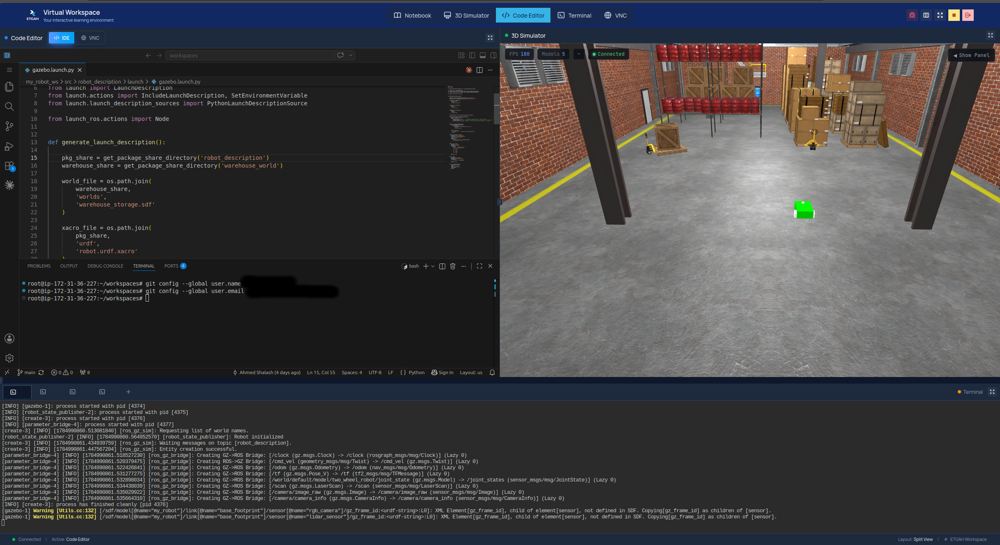

---

## 4. Mapping the Warehouse with SLAM Toolbox

With the world already running (step 3), in a second terminal:

```bash
ros2 launch slam_toolbox_demo slam_toolbox_online_async.launch.py
```

Then, in a third terminal, teleoperate the robot through every aisle and open area:

```bash
ros2 run teleop_twist_keyboard teleop_twist_keyboard
```

Watch the `/map` topic build live in RViz while driving — cover every aisle, get close enough to walls/shelves for clean LiDAR returns, and loop back over previously-covered ground occasionally so SLAM Toolbox can close loops and correct drift.

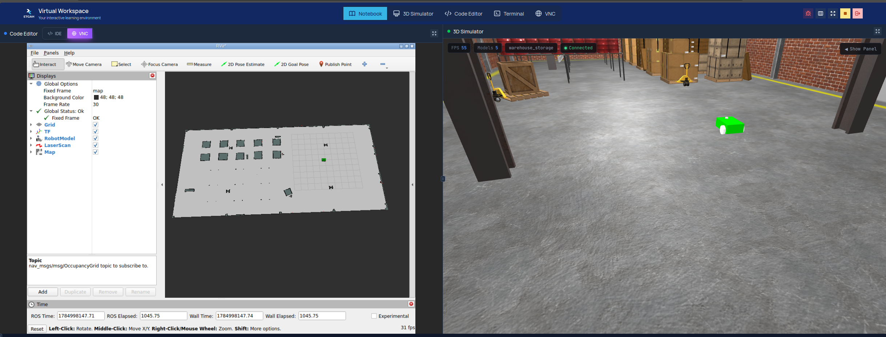

---

## 5. Saving the Warehouse Map

Once the map in RViz is complete and clean (closed boundary, no ghosted double-walls, no big unexplored gaps):

```bash
ros2 run nav2_map_server map_saver_cli -f warehouse_world_map
```

This produces `warehouse_world_map.pgm` and `warehouse_world_map.yaml`. Both are committed in this repo under `slam_toolbox_demo/map/` (the mapping output) and `robot_navigation/map/` (the copy used for localization/navigation).

---

## 6. Launching & Testing AMCL Localization

For isolated AMCL testing (map_server + AMCL only, no Nav2 servers):

```bash
# Terminal 1
ros2 launch robot_description gazebo.launch.py
# Terminal 2
ros2 launch robot_navigation amcl.launch.py
```

In RViz: set Fixed Frame to `map`, add `Map`, `TF`, `RobotModel`, `LaserScan`, and `ParticleCloud` displays, then use **2D Pose Estimate** to set the robot's real starting pose.

| Initial pose (wide particle spread) | After moving (converged) |
|---|---|
| 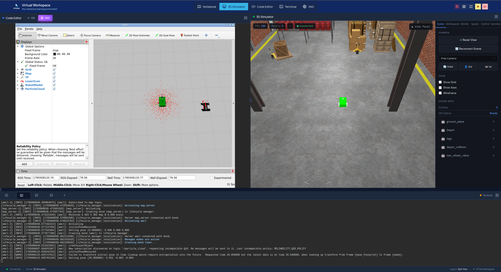 | 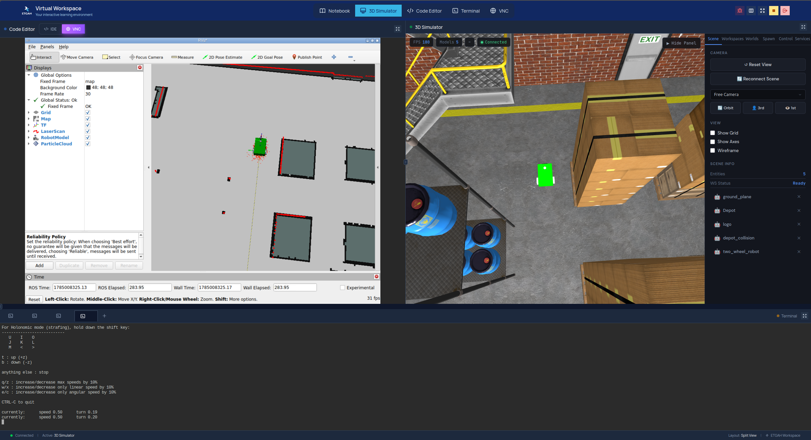 |

The particle cloud collapses tightly around the robot and the live LaserScan aligns with the map's walls, confirming correct convergence.

> Note: `amcl.launch.py` is kept for isolated testing only. For the actual mission, use `nav2_bringup.launch.py` (step 7) — don't run both at once, since two `map_server`/`amcl` node pairs would conflict.

---

## 7. Launching the Complete Nav2 System

```bash
# Terminal 1
ros2 launch robot_description gazebo.launch.py
# Terminal 2
ros2 launch robot_navigation nav2_bringup.launch.py
```

This brings up `map_server`, `amcl`, `planner_server`, `controller_server`, `behavior_server`, and `bt_navigator`, all managed by a single `lifecycle_manager_navigation`. In RViz, add the global/local costmap and global/local plan displays, then test with a manual **2D Nav Goal** before running the automated mission.

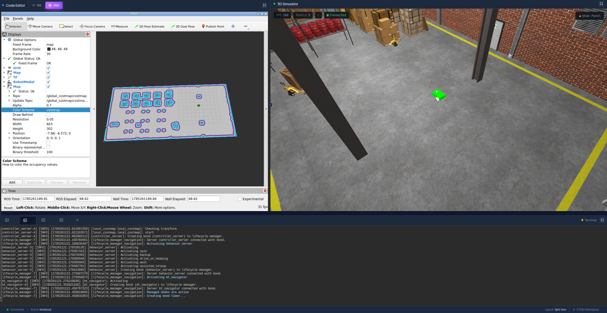

---

## 8. Waypoint Names, Positions & Orientations

All poses are in the `map` frame, recorded via `/amcl_pose` after driving the localized robot to each real location and confirmed with RViz's 2D Nav Goal tool.

| Waypoint | x (m) | y (m) | yaw (rad) | Role |
|---|---|---|---|---|
| **Home** | -0.425 | 7.25 | 1.57 | Charging Station — mission start & final destination |
| **Loading** | 18.575 | 3.80 | -1.57 | Wait here 30 seconds |
| **Storage** | 7.335 | -5.50 | 3.14 | Second navigation goal |
| **Shipping** | -7.105 | 0.75 | 1.57 | Third navigation goal |

---

## 9. Mission Route

```
Home (start, align to recorded pose)
   │
   ▼
Loading Station ──── wait 30 seconds
   │
   ▼
Storage Area
   │
   ▼
Shipping Station
   │
   ▼
Home (final — mission complete)
```

Each leg is sent only after the previous `NavigateToPose` goal returns `SUCCEEDED`. Any other result (rejected, aborted, canceled) immediately stops the mission and logs the name and pose of the failed target.

Run the mission with:

```bash
ros2 run warehouse_waypoints waypoints
```

(with `gazebo.launch.py` and `nav2_bringup.launch.py` already running, as in step 8)

| Home → Loading | Loading → Storage | Storage → Shipping | Shipping → Home |
|---|---|---|---|
| 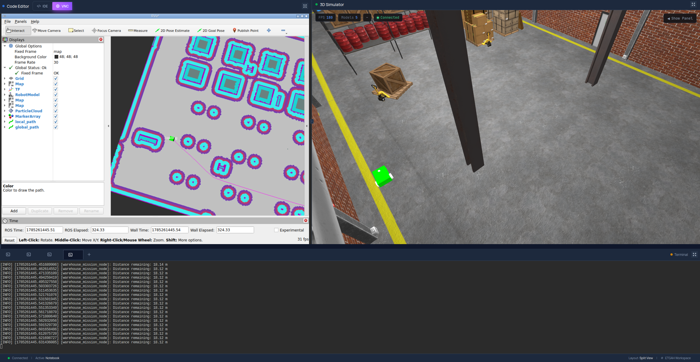 | 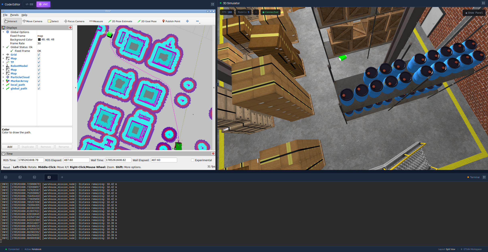 | 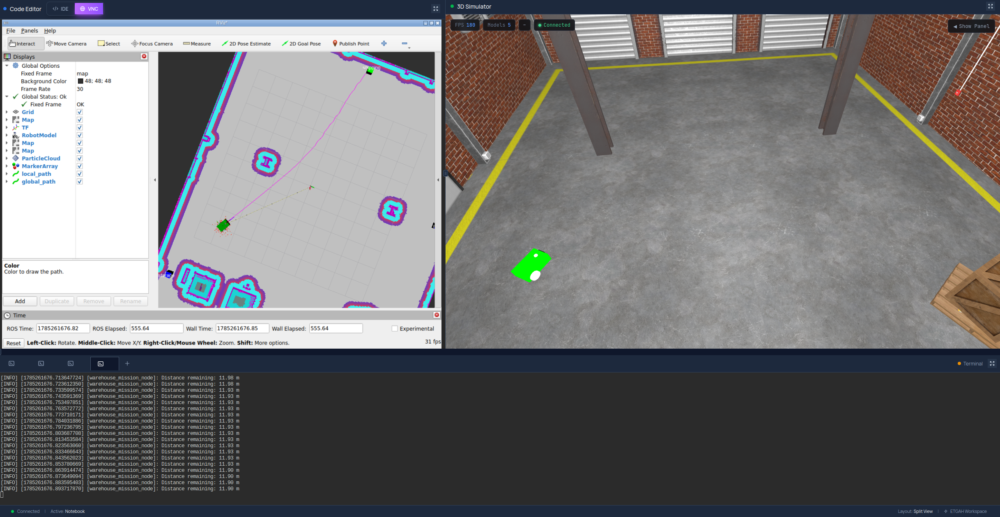 | 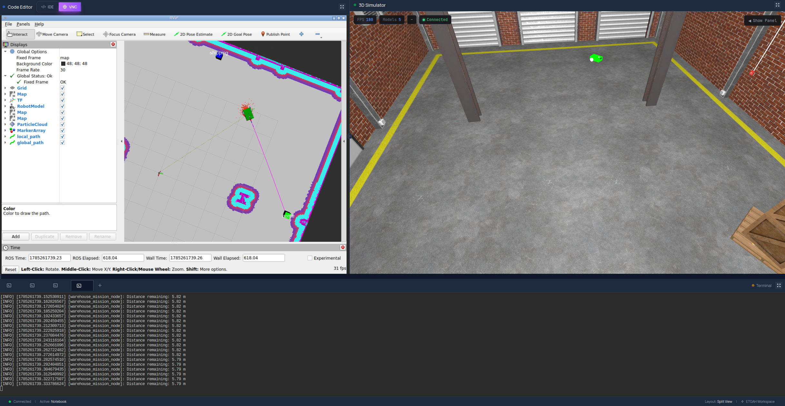 |

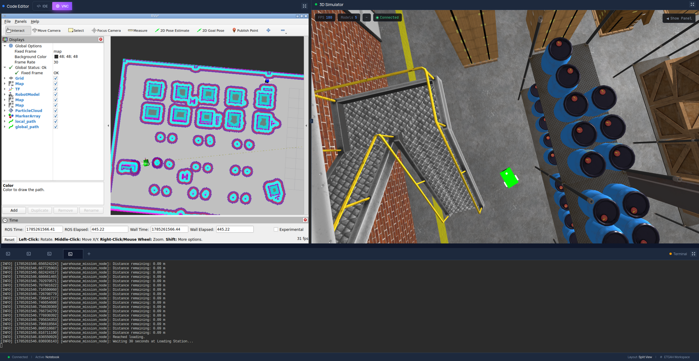
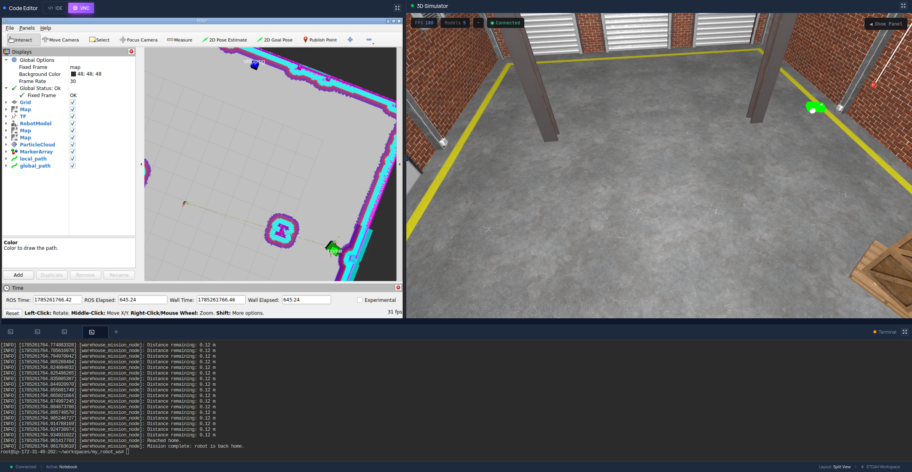

---

## 10. RViz Waypoint-Marker Behavior

All four named waypoints are published as a single `visualization_msgs/msg/MarkerArray` on:

```
/waypoint_markers
```

- **Inactive** waypoints render **blue**
- The **current active navigation goal** renders **green**
- A `TEXT_VIEW_FACING` label is published above each marker with its name (`home`, `loading`, `storage`, `shipping`)
- The array republishes every time the active goal changes, and the publisher uses `TRANSIENT_LOCAL` durability so RViz always shows the last known state, even if the `MarkerArray` display is added after a publish already happened

| Home | Loading | Storage | Shipping |
|---|---|---|---|
| 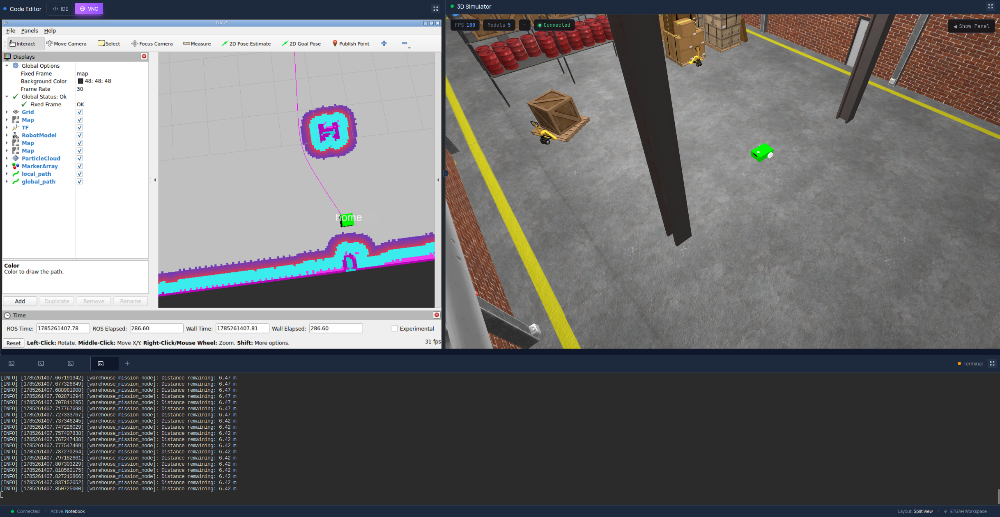 | 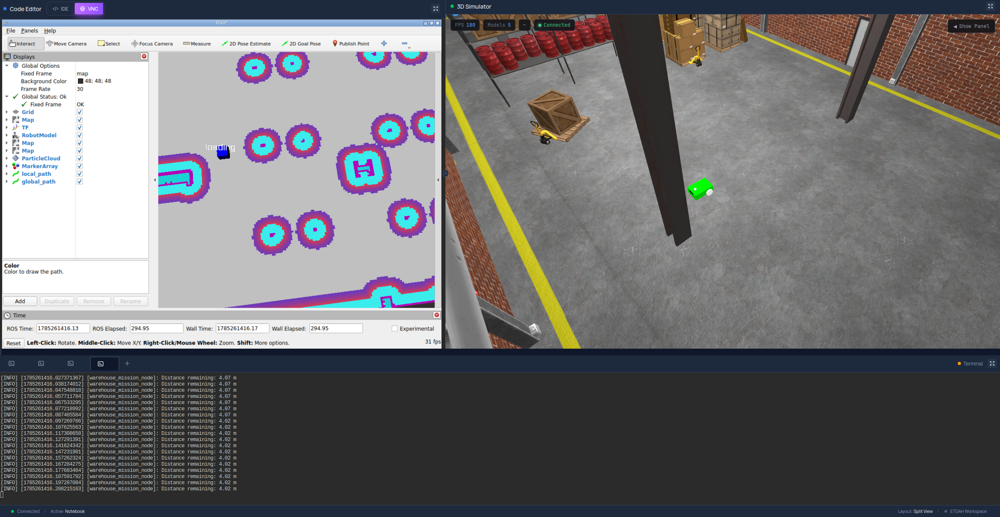 | 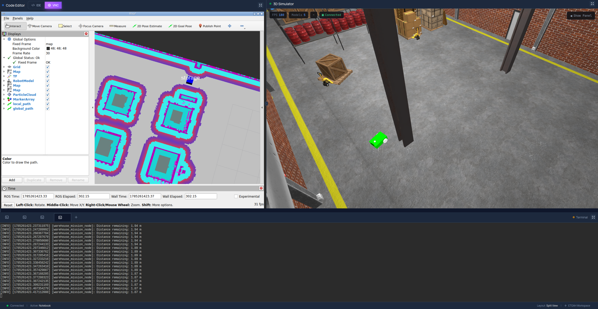 | 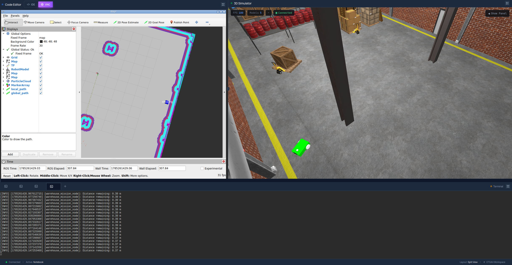 |

---

## 11. Screenshots

| Process | Screenshot |
|---|---|
| Robot spawn in the warehouse world |  |
| SLAM Toolbox mapping in progress |  |
| AMCL initial pose (wide particle spread) |  |
| AMCL converged after moving |  |
| Global costmap |  |
| Global path: Home → Loading |  |
| Global path: Loading → Storage |  |
| Global path: Storage → Shipping |  |
| Global path: Shipping → Home |  |
| Home waypoint marker |  |
| Loading waypoint marker |  |
| Storage waypoint marker |  |
| Shipping waypoint marker |  |
| Robot waiting 30 seconds at the Loading Station |  |
| Mission complete |  |

---

## 12. Demonstration Videos

- **Mapping (SLAM Toolbox):** https://drive.google.com/file/d/1CRSMIKPQ3oPgoRimnO1INP7pY9xJKcKL/view?usp=drive_link
- **Localization (AMCL):** https://drive.google.com/file/d/1kfTapWqhwKZDmNV5YrpKrowu9gV4I2kb/view?usp=drive_link
- **Autonomous Navigation & Waypoint Mission:** https://drive.google.com/file/d/108dRYjYEr6X3-wobmeulxMfItEecenlE/view?usp=drive_link

---

## Author

**Ahmed Shalash**
Final Project — ROS 2 Robotics Masterclass (ETGAH)